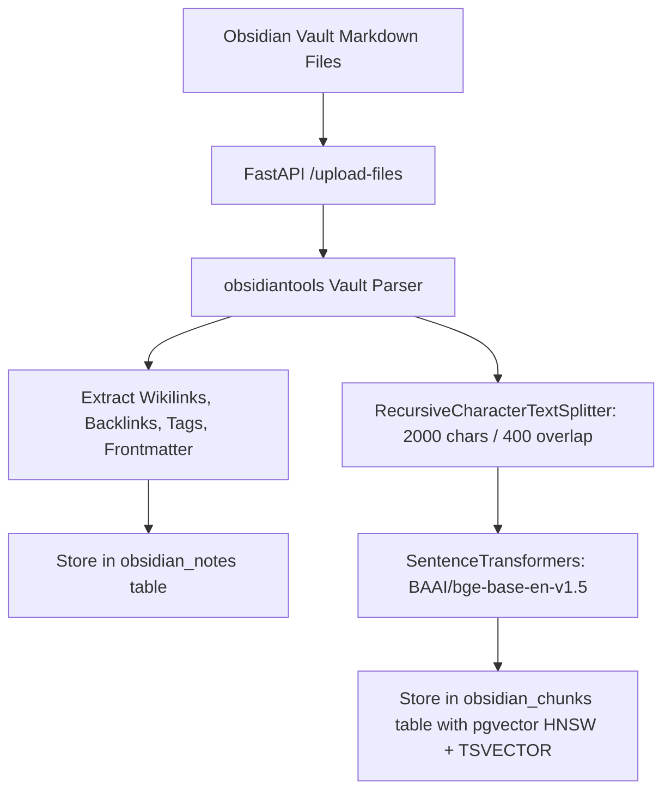
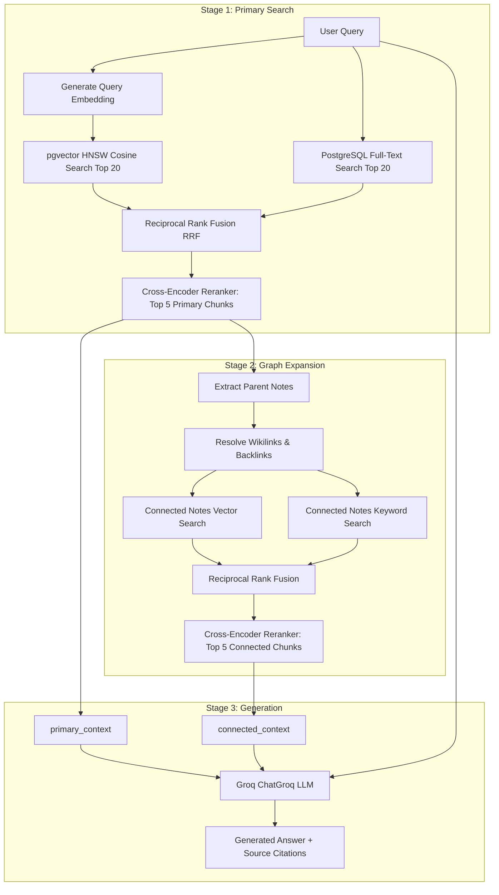
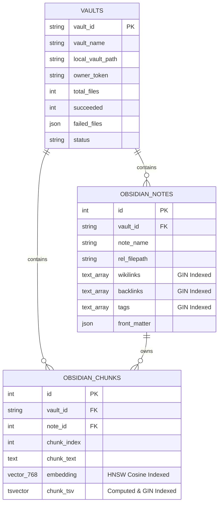

# 🧠 Obsidian Vault AI Server

> **Enterprise-grade Graph-Aware RAG (GraphRAG), Hybrid Retrieval, and Context Engine tailored for Obsidian Knowledge Bases.**

[](https://obsidian-vault-ai-server.vercel.app/)

[](https://fastapi.tiangolo.com/)
[](https://nextjs.org/)
[](https://github.com/pgvector/pgvector)
[](https://groq.com/)
[](https://www.python.org/)
[](https://github.com/astral-sh/uv)
[](https://www.docker.com/)

---

🌐 **Live Demo:** [https://obsidian-vault-ai-server.vercel.app/](https://obsidian-vault-ai-server.vercel.app/)

---

## 📖 Overview

**Obsidian Vault AI Server** is an intelligent context engine and conversational AI system designed specifically for Obsidian vaults. Unlike traditional Retrieval-Augmented Generation (RAG) systems that treat notes as isolated text chunks, this server natively models and traverses Obsidian's knowledge graph—including **Wikilinks (`[[...]]`)**, **Backlinks**, **Tags (`#tag`)**, and **YAML Frontmatter**.

It combines **Dense Vector Search** (HNSW cosine similarity via `pgvector`), **Full-Text Keyword Search** (PostgreSQL `tsvector` with GIN indexing), **Reciprocal Rank Fusion (RRF)**, and **Cross-Encoder Re-ranking** (`ms-marco-MiniLM-L6-v2`) with a secondary **Graph Expansion Stage** to feed ultra-relevant, cited context to high-speed LLMs powered by **Groq**.

Included out of the box is a modern **Next.js 16 Web UI**, background job pipelines, incremental file synchronization endpoints, and full Docker containerization.

---

## ✨ Key Features

- 🕸️ **2-Stage Graph-Aware Retrieval (GraphRAG)**:
  1. **Primary Hybrid Search**: Fetches the top vector and keyword matches, fused with Reciprocal Rank Fusion (RRF) and scored by a Cross-Encoder.
  2. **Graph Expansion**: Dynamically identifies parent notes, extracts connected Wikilinks and Backlinks, and retrieves secondary contextual chunks from adjacent notes.
  3. **Context-Isolated Prompting**: Passes explicitly separated `<primary_context>` and `<connected_context>` blocks to eliminate hallucinations.
- ⚡ **Hybrid Search & Re-ranking**:
  - Dense embeddings via `BAAI/bge-base-en-v1.5` (768 dimensions).
  - PostgreSQL full-text search with `websearch_to_tsquery` and `ts_rank_cd`.
  - Re-ranking with `cross-encoder/ms-marco-MiniLM-L6-v2`.
- 🔄 **Real-Time Incremental File Synchronization**:
  - Syncs individual note modifications, creates, and deletions in milliseconds via `/vaults/{vault_id}/sync-file` and `/vaults/{vault_id}/files`.
  - Works seamlessly with the companion watcher client or file-watching hooks.
- 🔍 **Intelligent Local Vault Discovery**:
  - Automatically scans Obsidian configuration files (`~/.config/obsidian/obsidian.json`, macOS Application Support, Windows AppData) and local directories to resolve vault paths.
- 🔒 **Multi-Tenant Security & Rate Limiting**:
  - Isolation per user with `owner_token` and `X-API-Key` validation.
  - Rate limiting on computationally expensive endpoints via `SlowAPI`.
- 💻 **Modern Next.js Web Interface**:
  - Real-time chat streaming, session history, source citations with filename badges, auto-discovery modal, and settings configurator.
- 🐳 **Optimized Docker Setup**:
  - Astral `uv` package management, pre-cached CPU PyTorch wheels, persistent HuggingFace model cache volume, and health checks.

---

## 🏗️ Architecture & Pipelines

### 1. Ingestion Pipeline


### 2. Graph-Aware Hybrid Retrieval Pipeline


---

## 🗄️ Database Schema

The database relies on **PostgreSQL with the `pgvector` extension** and is structured into 3 relational models:



---

## 🛠️ Tech Stack

| Layer | Technology | Purpose |
| :--- | :--- | :--- |
| **Backend Framework** | [FastAPI](https://fastapi.tiangolo.com/) | High-performance asynchronous REST API |
| **Package Manager** | [Astral `uv`](https://github.com/astral-sh/uv) | Ultra-fast Python package resolver & installer |
| **Database & ORM** | [PostgreSQL](https://www.postgresql.org/) + [pgvector](https://github.com/pgvector/pgvector) + [SQLAlchemy 2.0](https://www.sqlalchemy.org/) + [Alembic](https://alembic.sqlalchemy.org/) | Relational metadata, vector embeddings, GIN text indexes, and migrations |
| **Vault Parsing** | [obsidiantools](https://github.com/tillahoffmann/obsidiantools) | Extracts wikilinks, backlinks, and frontmatter |
| **Embeddings** | [SentenceTransformers](https://www.sbert.net/) (`BAAI/bge-base-en-v1.5`) | 768-dimensional dense vector embeddings |
| **Re-ranker** | [CrossEncoder](https://www.sbert.net/) (`cross-encoder/ms-marco-MiniLM-L6-v2`) | Precision re-ranking of retrieved candidate chunks |
| **LLM Inference** | [LangChain Groq](https://github.com/langchain-ai/langchain-groq) | Ultra-low-latency LLM generation (`openai/gpt-oss-120b`, `llama-3.3-70b-versatile`, etc.) |
| **Frontend** | [Next.js 16](https://nextjs.org/) (App Router), React 19, Tailwind CSS v4, Lucide Icons | Responsive interactive chat & vault management interface |
| **Containerization** | Docker & Docker Compose | Multi-container orchestrated deployment |

---

## 📁 Repository Structure

```
.
├── Dockerfile                  # Production backend container build (Python 3.12 + uv)
├── docker-compose.yml          # Multi-container orchestration (Backend + Frontend)
├── pyproject.toml              # Python project metadata and dependencies
├── uv.lock                     # Deterministic dependency lockfile
├── alembic.ini                 # Database migration configuration
├── alembic/                    # Alembic migration revisions and env
│   └── versions/               # Schema migration scripts
├── src/
│   └── obsidian_vault_ai_server/
│       ├── __init__.py         # FastAPI application entrypoint & routing
│       └── app/
│           ├── database/       # Async SQLAlchemy session and base setup
│           ├── models/         # SQLAlchemy models (Vaults, ObsidianNotes, ObsidianChunks)
│           ├── schema/         # Pydantic request/response schemas
│           ├── services/
│           │   ├── chunker.py           # Recursive text splitting logic
│           │   ├── embedder.py          # BAAI/bge-base-en-v1.5 embedding generator
│           │   ├── reranker_service.py  # CrossEncoder re-ranking service
│           │   ├── llm_service.py       # Groq ChatPromptTemplate & generation
│           │   └── pipelines.py         # Full vault ingestion, 2-stage retrieval, sync & delete
│           └── utils/
│               ├── auth.py              # API key verification & owner token dependencies
│               ├── config.py            # Pydantic settings management (.env)
│               ├── file_validator.py    # File upload validation & size guards
│               └── retrieval_utils.py   # Reciprocal Rank Fusion (RRF) algorithm
└── frontend/
    ├── Dockerfile              # Next.js frontend container build
    ├── package.json            # Node.js dependencies
    ├── app/                    # Next.js App Router (page.tsx, layout.tsx, globals.css)
    ├── components/             # Reusable UI components
    └── lib/                    # API client, chat storage, and state utilities
```

---

## 🚀 Getting Started

### Prerequisites

- **Docker** & **Docker Compose** installed (Recommended method), OR:
- **Python 3.12+** with [`uv`](https://github.com/astral-sh/uv)
- **Node.js 20+** & `npm` / `pnpm`
- **PostgreSQL 15+** instance with `pgvector` extension enabled (e.g. [Neon](https://neon.tech), Supabase, or local Postgres)
- **Groq API Key** ([Get a free Groq API key here](https://console.groq.com/keys))

---

### 1. Environment Configuration

Copy the example environment file and configure your credentials:

```bash
cp .env.example .env
```

Edit `.env` with your settings:

```dotenv
# Async PostgreSQL connection string for FastAPI (asyncpg)
DATABASE_URL=postgresql+asyncpg://<username>:<password>@<host>:<port>/<database>?ssl=require

# Synchronous PostgreSQL connection string for Alembic migrations (psycopg)
DATABASE_URL_ALEMBIC=postgresql+psycopg://<username>:<password>@<host>:<port>/<database>?ssl=require

# Groq API configuration
GROQ_API_KEY=gsk_your_groq_api_key_here
GROQ_MODEL=openai/gpt-oss-120b

# Secret API Key for server authentication
API_KEY=your_secure_server_api_key_here
```

---

### 2. Option A: Run with Docker Compose (Recommended)

To build and run both Backend (port `8000`) and Frontend (port `3000`):

```bash
docker compose up --build -d
```

- **Frontend UI**: [http://localhost:3000](http://localhost:3000)
- **Backend API**: [http://localhost:8000](http://localhost:8000)
- **Interactive Swagger Docs**: [http://localhost:8000/docs](http://localhost:8000/docs)

To view logs:
```bash
docker compose logs -f
```

To stop containers:
```bash
docker compose down
```

---

### 3. Option B: Local Development Setup

#### Backend Setup

1. **Install Python dependencies with `uv`:**
   ```bash
   uv venv
   source .venv/bin/activate  # On Windows: .venv\Scripts\activate
   uv pip install -r pyproject.toml
   ```

2. **Run database migrations:**
   ```bash
   alembic upgrade head
   ```

3. **Start the FastAPI backend server:**
   ```bash
   uvicorn obsidian_vault_ai_server:app --host 0.0.0.0 --port 8000 --reload
   ```

#### Frontend Setup

1. **Navigate to the frontend directory and install dependencies:**
   ```bash
   cd frontend
   npm install
   ```

2. **Configure environment:**
   Create `frontend/.env.local`:
   ```dotenv
   NEXT_PUBLIC_BACKEND_URL=http://localhost:8000
   API_KEY=your_secure_server_api_key_here
   ```

3. **Start the Next.js development server:**
   ```bash
   npm run dev
   ```
   Open [http://localhost:3000](http://localhost:3000) in your browser.

---

## 📡 API Reference

All protected endpoints require the following headers:
- `X-API-Key: <your_api_key>`
- `X-Owner-Token: <client_owner_token>` (Identifies and isolates vaults for the user)

### Core Endpoints

| Method | Endpoint | Description |
| :--- | :--- | :--- |
| `GET` | `/health` | Public healthcheck for monitoring and load balancers. |
| `GET` | `/discovered-vaults` | Scans local host Obsidian configs for available vaults. |
| `POST` | `/upload-files` | Ingests a full vault (Multipart Form files, `job_name`, `local_vault_path`). |
| `POST` | `/qna` | Runs 2-stage GraphRAG search and generates an answer with sources. |
| `GET` | `/status/{job_id}` | Polls ingestion status (`Processing`, `Success`, `Failed`). |
| `GET` | `/vaults` | Lists all indexed vaults owned by the token. |
| `DELETE` | `/vaults/{vault_id}` | Deletes a vault and cascades deletion of notes & chunks. |
| `POST` | `/vaults/{vault_id}/sync-file` | Incrementally re-indexes or creates a single note (`rel_filepath`, `content`). |
| `DELETE` | `/vaults/{vault_id}/files` | Deletes a single note and its vector chunks (`rel_filepath`). |
| `GET` | `/vaults/{vault_id}/files` | Returns list of all indexed notes in a vault. |
| `PATCH` | `/vaults/{vault_id}/path` | Updates the stored local filesystem path for a vault. |

---

### Example API Requests

#### 1. Ask a Question (`POST /qna`)
```bash
curl -X POST "http://localhost:8000/qna" \
  -H "Content-Type: application/json" \
  -H "X-API-Key: your_api_key" \
  -H "X-Owner-Token: client_my_token_123" \
  -d '{
    "job_id": "your_vault_id",
    "query": "How does our note linking structure relate to machine learning concepts?"
  }'
```

**Sample Response:**
```json
{
  "answer": "Based on your knowledge base, note linking mirrors semantic graph representations...",
  "sources": [
    {"filename": "Concepts/Machine Learning.md"},
    {"filename": "Graph Theory/Semantic Networks.md"}
  ]
}
```

#### 2. Incremental Note Sync (`POST /vaults/{vault_id}/sync-file`)
```bash
curl -X POST "http://localhost:8000/vaults/your_vault_id/sync-file" \
  -H "Content-Type: application/json" \
  -H "X-API-Key: your_api_key" \
  -H "X-Owner-Token: client_my_token_123" \
  -d '{
    "rel_filepath": "Projects/New Project.md",
    "content": "---\ntags: [ai, planning]\n---\n# New Project\nSee [[Architecture]] and [[Milestones]]."
  }'
```

---

## 🔄 Companion Client & File Watcher

The server is designed to work in tandem with the [Obsidian-Vault-AI-Client](https://github.com/Shreyansh-kushw/Obsidian-Vault-AI-Client) or any custom file-system watcher (e.g. `watchdog` in Python).

When you edit, create, or delete markdown files in Obsidian, the client watches your vault directory and sends live updates to `/sync-file` and `/files`, ensuring your GraphRAG vector index is always up to date without needing full re-uploads!

---

## 🗃️ Database Migrations

This project uses **Alembic** to manage database schema evolutions.

- **Apply all migrations:**
  ```bash
  alembic upgrade head
  ```
- **Create a new migration revision:**
  ```bash
  alembic revision --autogenerate -m "describe your migration"
  ```
- **Rollback last migration:**
  ```bash
  alembic downgrade -1
  ```

---

## ⚙️ Configuration & Customization

| Variable | Default | Description |
| :--- | :--- | :--- |
| `DATABASE_URL` | *Required* | Async connection URL for PostgreSQL (`asyncpg`). |
| `DATABASE_URL_ALEMBIC` | *Required* | Sync connection URL for Alembic migrations (`psycopg`). |
| `GROQ_API_KEY` | *Required* | API key for Groq inference. |
| `GROQ_MODEL` | `openai/gpt-oss-120b` | Groq model identifier (e.g., `llama-3.3-70b-versatile`, `mixtral-8x7b-32768`). |
| `API_KEY` | `""` | Server-wide access authentication key. |
| `FRONTEND_PORT` | `3000` | Port on host mapped to Next.js frontend container. |
| `HF_HOME` | `/root/.cache/huggingface` | HuggingFace model cache directory (persisted in Docker volume). |

---

## 🤝 Contributing

Contributions are welcome! Please follow these steps:
1. Fork the repository.
2. Create your feature branch (`git checkout -b feature/amazing-feature`).
3. Commit your changes (`git commit -m 'Add amazing feature'`).
4. Push to the branch (`git push origin feature/amazing-feature`).
5. Open a Pull Request.

---

## 📄 License

Distributed under the **MIT License**. See `LICENSE` for more information.

---

## 👤 Author

**Shreyansh Kushwaha**
- GitHub: [@Shreyansh-kushw](https://github.com/Shreyansh-kushw)
- Email: [shreyansh.kushw@gmail.com](mailto:shreyansh.kushw@gmail.com)
